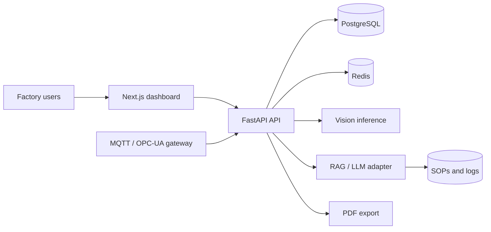
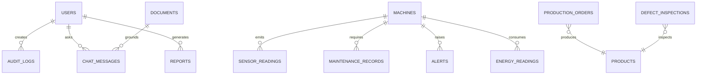

# Architecture

The API is stateless and uses PostgreSQL as the system of record. Redis is reserved for rate limits, asynchronous work, WebSocket fan-out, and cached analytics. MQTT ingestion must validate and normalize every message before persistence. AI model inference belongs behind adapters so an OpenAI, Ollama, or on-premise provider can be selected by environment.

## Entity relationships

